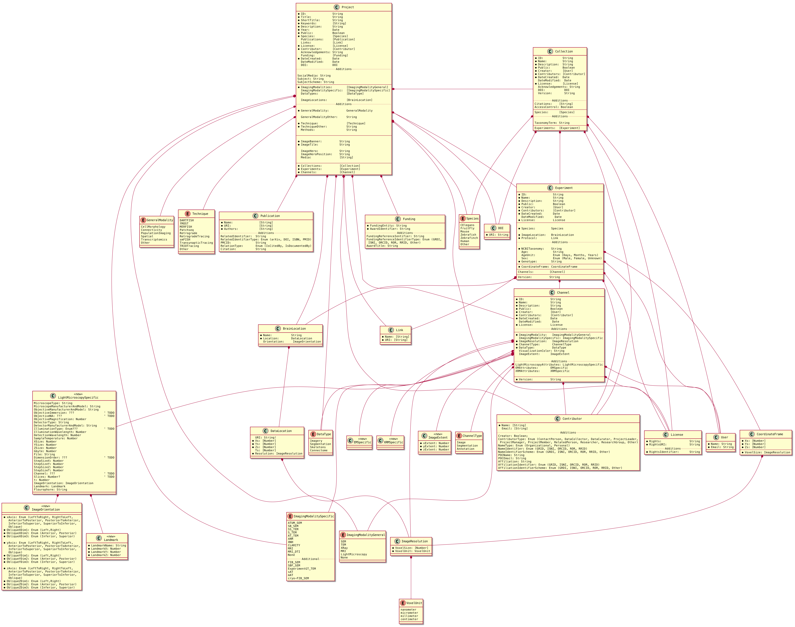
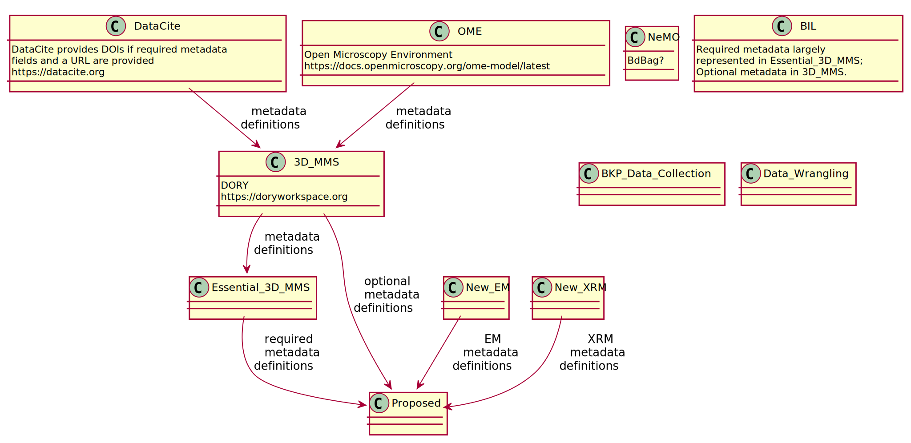

Rationale
=========

Scope / Purpose
===============

Metadata Standard Development Approach
======================================

Schema Development
------------------

### Extant Schemas Examined (To Date)

### Proposed paths forward

Metadata Standard Initial Draft Text
====================================

Metadata Schema PlantUML Representation
---------------------------------------

Metadata Schema Structure Discussion
------------------------------------

Metadata Schema Element Discussion
----------------------------------

### Project

### Collection

### Experiment

### Channel

### Funding

### GeneralModality

### Technique

### Publication

### DOI

### Contributor

### Species

### Link

### User

### License

### ChannelType

### DataType

### ImageResolution

### VoxelUnit

### CoordinateFrame

### BrainLocation

### DataLocation

### ImagingModalityGeneral

### ImagingModalitySpecific

### LightMicroscopySpecific

### ImageOrientation

### Landmark

Appendices

Metadata Schema Overview Diagram
--------------------------------

Metadata Schema Derivation (Schema Relationships Diagram)
---------------------------------------------------------

