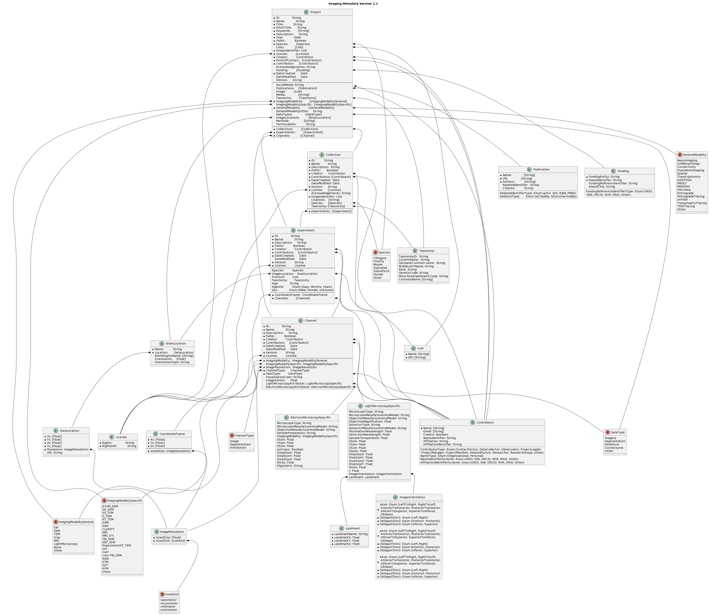

# BENCHMARK Connectomics Metadata Standards v1.1
BENCHMARK Team, https://github.com/aplbrain/benchmark-metadata

Rationale
=========
While data standards have been proposed for neurophysiology (NWB, BIDS, and 3D microscopy), challenges in size and acquisition techniques limit information exchange in EM connectomics. To overcome these barriers, metadata must be harmonized for cross-modality projects. To address this, the  Big-Data Electron-Microscopy for Novel Community Hypotheses: Measuring And Retrieving Knowledge (BENCHMARK) team formed a working group to form image and experimental metadata standardization recommendations for the EM connectomics community. 

Scope / Purpose
===============
The Imaging Working Group contained experimentalists with imaging experience, data scientists, and informatics experts with large scaled processing and data storage experience for XRM and EM imaging modalities. The group’s focus was on 1) Image file formats and 2) Imaging and Experimental Metadata, and consisted of reviewing preliminary information from past datasets, breakouts to discuss use cases and requirements, breakouts to discuss metadata topics and data formats, gathering feedback on existing standards approaches, and developing release and data maintenance plans. Additional meetings were held with individual laboratories as well as small-group discussions on targeted topics. Considering the complexity of annotation data and metadata, our efforts are focused on continuously refining our methods to align with the evolving requirements of the connectomics community. This is to enhance accessibility, interoperability, and reusability of data across various archives.

Metadata Standard Development Approach
======================================
The working group met to discuss key guiding principles of standards development in this field, including:
* Building on existing file formats and standards efforts when possible
* Promoting interoperability across EM Connectomics archives/tools 
* Promoting accessibility and findability across modalities
* Planning for scale and distributed cloud-based computing

During working group meetings, subgroups were formed to discuss image and data file types, linking between datasets, potential multimodal experiments and cross-archive analysis. An emphasis was placed on preserving existing workflows, both within laboratories and existing software tools. Image formats and metadata standards were proposed to address issues during interoperation (e.g. data ingest), data dissemination, and secondary data analysis. The working group recommended these standards be implemented in software tools for data archives and processing software to enable interoperability. After each working group meeting, recommendations were aggregated by the core standards team. Draft documents are available at https://github.com/aplbrain/benchmark-metadata for continued community refinement. 

In addition to working group meetings, extensive review of several existing, related standards was conducted. This was intended to leverage existing standards, harmonize efforts across archives, and promote a pathway to sustainability, possibly as an extension to an existing standards effort. Continued refinement of these draft standards will focus on harmonization with other metadata specifications. The reviewed standards included:
* Metadata services for the archives NEMO, DANDI, BossDB, Dvid, webKnossos and BIL
* The standard for 3D Microscopy (associated with BIL)
* Neurodata Without Borders (associated with DANDI)
* Brain Imaging Data Standard
* Standards of the Volume EM community

Metadata Standard Initial Draft Text
====================================
We are preparing a preprint discussing imaging standard formats, image and experimental metadata, and annotation formats, which will provide detailed text description of the BENCHMARK v1.1 standards. 

Metadata Schema PlantUML Representation
---------------------------------------
A full representation of the standard can be found in the plantuml definition. This defines the relationship between the key class, the Project, and the related data classes (collections, experiments, and channels) and the associated metadata fields. 

Metadata Schema Element Discussion
----------------------------------

### Project
The projects class contains 36 fields that give a high-level description of a dataset. These high-level descriptions include the title, short title, description, year, the DOI (Digital Object Identifier), and more. The project entity is the highest-level object which gives an overview of the data available in a dataset. This enables users to reference a list of projects with a thorough description and query key project metadata. String identifiers allow for easy search, and embedded identifiers ensure data satisfies FAIR principles. Boolean values represent if a project is public or has a publication, and each project links to related papers and indicates any modification to the project. The project contains links to the collections which make up the project. 

### Collection
The collections class consists of 18 fields used to associate a set of experiments within a project. A project may contain multiple collections. Collections may associate a set of experiments from a single subject or from a single paper. These may have separate creators, identifiers, and licenses from a project, so long as they are a subset of the overall project creators, identifiers, and licenses. A collection may contain experiments with different coordinate frames (e.g. different brain regions). 

### Experiment
The experiments class consists of 20 fields defining a set of data which share a common coordinate frame. An experiment consists of one or more Channels associated with the coordinate frame. An experiment may have separate creators, identifiers, and licenses from a collection, as long as they are a subset of the overall collection creators, identifiers, and licenses. It also includes a field for an identifier for an experimental protocol. An experiment may contain channels with different data types, such as raw imagery and segmentations. 

### Channel
The channel class consists of 19 fields defining a three-dimensional volume of imaging data, with a defined coordinate frame. The data may consist of different types, such as unsigned integer or float, but a given channel may only have one type of data. A channel has a uniform resolution for each of the X, Y, and Z dimensions (which may differ between them). A channel may have creators, licenses, and identifiers which are separate from the experiment, as long as they are a subset of the overall experiment creators, identifiers, and licenses. A channel has one associated coordinate frame (which must be the same as the experiment coordinate frame). 

### CoordinateFrame
The coordinate frame consists of four entities specifying an extent for the X, Y, and Z axis of a three-dimensional volume. Each dimension is specified as a minimum and maximum float value in a list. The resolution of each voxel (in X, Y and Z) is specified for the coordinate frame. It is recommended, but not required, that coordinate frames share a common reference within a project. Future work will consider mappings to common coordinate frameworks, as they are established in the field. 

### Funding
The funding class contains 5 fields explaining the organization(s) that financially support a given project. The funding class will provide information regarding what corporation or grant provided resources to support the project. These resources can come from various sources (e.g., government, individual donors, etc.), and the fields that are included in the funders class are funding entity, award identifier, finding reference identifiers, funding resources identifiers type, and award title.

### Publication
In the publication class, there are 8 fields capturing information about a dataset, papers, and where publications can be found. This allows for tracking the impact the work with a particular dataset. The fields that are included in the publication class are URI, authors, related identifiers, PubMed Central Identification (PMCID), relation type, and citation. This class is critical to give creditability and validity to the team which generated the dataset. 

### Contributor
The contributor entity consists of 11 fields that provide information about personnel associated with a specific project. This class gives information of the individual or group members who provided skills, knowledge, and resources for a particular project. The standard specifies the role that the contributor played towards the project, and each project is assigned a point of contact. There is also a minimum of one creator for each project. 

Out of the 11 fields, 6 fields in the contributor class associated with digital identifiers. These identifiers include ORCID (Open Researcher and Contributor Identifier), RRID (Research Resource Identifiers), ISNI (International Standard Name Identifier), ROR (Research Organization Registry), and a few others.

### Taxonomy
The taxonomy class contains 8 fields that provide information to categorize and classify biological samples and species. These classes are Taxonomy ID, current name, GenBank common name, NCBI BLAST name, rank, genetic, mitochondrial genetic code, and common name. Taxonomy information can be found on the National Library of Medicine Taxonomy website where taxonomy field helps classify, name, and organize living organisms based on their shared characteristics and evolutionary relationships. 

### License
Within the license class, there are 4 field that give information about the licenses which govern usage of the data for this project. This specifies the terms and agreements that protects the rights of a project. In the license class,  the fields that are required includes the URI to the rights, identifier, and corresponding DOI. The project may have multiple licenses associated, which reference individual datasets within the given project. For example, all public projects on the archive BossDB are currently licensed under the Creative Commons Attribution 4.0 International License.

### BrainLocation
The brain location class contains 4 fields to capture the location of a coordinate frame within a larger brain volume. This contains information about the spatial position and orientation of a coordinate frame within a brain. It also contains a string name of the region. It is recommended, but not required, that if this class exists for an experiment the information is consistent with an established coordinate frame. 

### LightMicroscopySpecific
This class is derived from the Standard metadata for 3D microscopy [30] and is included to promote compatibility with this standard. Future work will investigate further methods for co-registraiton and harmonization of these standards. The light microscopy specific class contains 28 fields to capture the properties of channels and experiments imaged with light microscopy techniques. This includes details on the microscope as well as experimental settings. 

### ElectronMicroscopySpecific
The electron microscopy specific class consists of XX fields which define metadata related to electron microscopes utilized to generate connectivity datasets. This includes information about the microscope itself as well as imaging techniques and settings. 

# Appendices

Acronym Definitions
-------------------

[Acronym table](acronyms-definitions.md)

Metadata Schema Overview Diagram
--------------------------------

Metadata Schema Derivation (Schema Relationships Diagram)
---------------------------------------------------------

[Derivation from Previous Schema](standards-development/schema-relationships.png)

